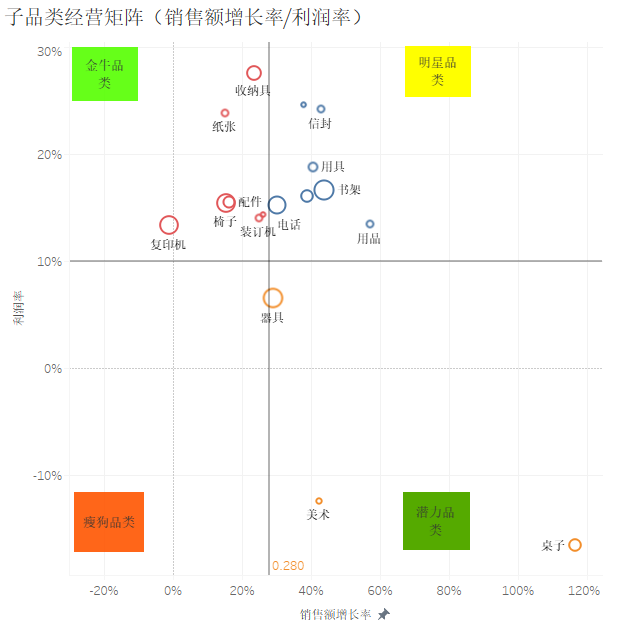

# 《大数据案例实务分析》第一次作业

## 电商二级品类经营矩阵分析

本项目以 Olist 电商数据比较 2017 年与 2018 年 1—8 月的品类经营表现。项目文件包括作业要求、原始数据、分析代码、结果表、分类矩阵及[研究报告](docs/report.pdf)。

---

## 一、作业要求

将用户下单时间在2018年1-8月对比2017年1-8月动销商品的品类，根据品类的销售额年同比增长率、订单量同比增长率两个指标，建立二级品类的分类矩阵，并对每个象限的品类提出对应的经营建议。

（要求有矩阵图，四个象限的数据描述及其对应的经营建议。结论明确突出，数据分析有数据支撑，制作一张矩阵图，3-4个关键指标。）

### 类似结果参考

1、明星品类：书架、电话等品类，维持现状的营销策略；

2、金牛品类：收纳具、复印机等品类，关注竞对，在维持总利润的情况下可以适当通过促销来提升销售额增速；

3、潜力品类：桌子、美术等品类，降低活动力度，提升利润率；

4、瘦狗品类：降低活动力度，提升利润率，加强宣传；

### 参考图片



[课程平台要求截图](goal/task_from_elearning.png) · [课件要求截图](goal/task_from_PPT.png)

题目文字指定矩阵纵轴为订单量同比增长率，示例图片却将纵轴标为利润率。报告依照文字要求使用订单量同比；原始数据没有成本信息，不能计算利润率。四象限的位置与名称沿用示例。

---

## 二、文件结构

```text
hw1/
├─ goal/
│  ├─ task.md                         作业原题
│  ├─ image.png                       矩阵示例
│  ├─ task_from_elearning.png         作业要求截图
│  └─ task_from_PPT.png               课件要求截图
├─ data/
│  ├─ 数据.zip                        原始 Excel 数据压缩包
│  └─ 数据/                          解压后的 9 个 Excel 工作簿；不纳入 Git
├─ code/
│  ├─ extract_data.py                仅提取压缩包中的 Excel 工作簿
│  ├─ analysis.py                    数据筛选、指标计算与矩阵绘图
│  └─ make_latex_tables.py           生成报告中的数值与表格
├─ docs/
│  ├─ report.pdf                     研究报告
│  ├─ report.tex                     报告源文件
│  ├─ figures/matrix.png             品类分类矩阵
│  └─ tables/                        分析结果 CSV、摘要 JSON 与 LaTeX 表格
├─ requirements.txt                  Python 依赖
└─ README.md
```

---

## 三、原始数据与文件选择

原始压缩包包含九个 Excel 工作簿。建立矩阵需要下单时间、订单状态、商品金额和品类名称，分别由下列四张表提供；另外五张表的字段已经核对，本作业不计算客户画像、支付结构、评价、卖家地域或站内行为指标。

| 文件（位于`data/数据/`）                 | 关键字段及本项目用途                                                                         |
| ------------------------------------------ | -------------------------------------------------------------------------------------------- |
| `olist_orders_dataset.xlsx`              | `order_id`、`order_status`、`order_purchase_timestamp`：确定订单及下单时间。           |
| `olist_order_items_dataset.xlsx`         | `order_id`、`order_item_id`、`product_id`、`price`：连接订单和商品，汇总商品销售额。 |
| `olist_products_dataset.xlsx`            | `product_id`、`product_category_name`：确定商品所属品类。                                |
| `product_category_name_translation.xlsx` | 葡语品类名、中文品类名：形成报告和图中的中文标签。                                           |
| `olist_order_payments_dataset.xlsx`      | 支付记录可用于分析支付方式，但`payment_value` 不是本题所需的商品金额，故不用于销售额计算。 |
| `olist_customers_dataset.xlsx`           | 客户地域和身份信息；本题不按客户分组。                                                       |
| `olist_order_reviews_dataset.xlsx`       | 订单评价信息；本题不分析满意度。                                                             |
| `olist_sellers_dataset.xlsx`             | 卖家地域信息；本题不按卖家分组。                                                             |
| `olist_user_experience_dataset.xlsx`     | 站内行为事件；没有可直接连接订单的`order_id`，不用于品类同比。                             |

---

## 四、分析方法

1. **检查表结构并建立关联。** [analysis.py](code/analysis.py) 读取上述四张主表，先检查订单表的 `order_id`、商品表的 `product_id` 和翻译表的葡语品类名是否唯一，以及订单明细的 `(order_id, order_item_id)` 是否重复。按 `order_id` 连接订单与订单明细，按 `product_id` 连接商品，再按 `product_category_name` 匹配中文名称。翻译表中缺少的两个品类名称由脚本明确补充；商品档案缺失和其他未翻译品类会触发检查错误。
2. **选择可比较的订单。** 依据 `order_purchase_timestamp` 分别取 2017 年、2018 年的 1 月 1 日至 8 月 31 日，两期均为 243 天。保留已批准、处理中、已开票、已发货和已送达的订单，排除仅创建、缺货和已取消的订单。2018 年 8 月的部分订单在数据截止时尚未送达，因此仅保留已送达订单会低估当期下单金额。品类名称缺失的商品单独统计，不分配给其他品类。
3. **汇总品类指标。** 对每一年、每个品类汇总订单明细中的 `price`，得到商品销售额（BRL，不含运费）；对 `order_id` 去重计数，得到品类订单量。一笔订单涉及多个品类时，分别计入相应品类。脚本将两期筛选数量、缺失品类数量和销售额写入 [data_quality.csv](docs/tables/data_quality.csv)。
4. **计算同比并识别新增、退出品类。** 按品类连接两年的汇总表；销售额同比与订单量同比均为“2018 年数值 ÷ 2017 年数值 − 1”。两期均有销售的 69 类进入矩阵；2018 年新增 3 类、退出 1 类不计算除零同比，均保存在 [category_metrics.csv](docs/tables/category_metrics.csv)。
5. **确定分界线并绘图。** 横轴为销售额同比，纵轴为订单量同比；对同一批有品类信息的商品计算整体销售额同比 **+139.8%** 和去重订单同比 **+139.1%**，作为两条分界线。若用 0% 为分界，69 类中有 54 类落在双增长象限，难以区分相对增速。矩阵图在线性坐标范围内展示 47 类，覆盖可比品类 2018 年销售额的 90.2%；主要品类直接标名，圆圈大小随销售额增加。全部 69 类仍参与象限统计，并在附录及结果表中逐项列出。
6. **核查并生成报告。** 脚本检查品类金额合计、同比公式和四象限汇总是否一致，并在只保留已送达订单时重新分类；该对照结果见 [status_sensitivity.csv](docs/tables/status_sensitivity.csv)。[make_latex_tables.py](code/make_latex_tables.py) 将结果表写入报告，XeLaTeX 编译生成 [report.pdf](docs/report.pdf)。

| 象限         | 销售额同比     | 订单量同比     | 经营含义                               |
| ------------ | -------------- | -------------- | -------------------------------------- |
| 明星（右上） | 高于或等于平台 | 高于或等于平台 | 两项增速均领先，重点保障供给           |
| 金牛（左上） | 低于平台       | 高于或等于平台 | 订单增长较快，关注单均商品金额         |
| 潜力（右下） | 高于或等于平台 | 低于平台       | 销售额增长较快，争取更多订单           |
| 瘦狗（左下） | 低于平台       | 低于平台       | 两项增速相对较慢，结合销售规模调整投入 |

[矩阵图](docs/figures/matrix.png)采用线性刻度，展示坐标范围内的 47 个品类，其中 13 类直接标名。其余增速较高的品类，以及全部品类的具体数值，见报告附录和 [category_metrics.csv](docs/tables/category_metrics.csv)。

---

## 五、主要结果

2018 年 1—8 月，有品类信息的商品销售额为 **726.8 万 BRL**，同比增长 **139.8%**；涉及 **52,934 笔去重订单**，同比增长 **139.1%**。69 个可比品类中，明星类的销售额占比为 **44.8%**，瘦狗类仍占 **39.3%**。后者虽然增速低于平台整体水平，仍有较大的销售规模，不能按象限名称直接决定退出。

| 象限 | 品类数 | 2018 年销售额占比 | 代表品类与经营建议                                                                 |
| ---- | -----: | ----------------: | ---------------------------------------------------------------------------------- |
| 明星 |     32 |             44.8% | 健康美妆、腕表礼品：保障库存和配送，并核查推广投入的效果。                         |
| 金牛 |      4 |              7.5% | 电脑及配件：检查商品价格结构及促销力度，测试配件搭配销售。                         |
| 潜力 |      3 |              8.3% | 家居日用、手机通讯：保留有效商品组合，改善曝光和购买转化。                         |
| 瘦狗 |     30 |             39.3% | 床品卫浴餐桌用品、运动休闲：先优化商品结构；对增速较慢的潮流新奇好物减少低效活动。 |

“高”“低”均相对于平台同期增速，并不表示品类盈利或亏损。28 个品类在 2017 年不足 30 单，增长率易受小基数影响；这些品类合计仅占 2018 年有品类信息商品销售额的 6.7%。仅保留已送达订单重新分类时，69 类中有 68 类的象限归属不变。利润和推广回报需另行取得成本、广告等数据后评估。

---

## 六、报告结构

| 内容               | 页码       | 主要信息                                       |
| ------------------ | ---------- | ---------------------------------------------- |
| 摘要与销售概况     | 第 1 页    | 比较期间、销售规模与品类分类概况。             |
| 数据与方法         | 第 1—2 页 | 订单筛选、品类指标计算及四象限分界标准。       |
| 矩阵结果           | 第 3 页    | 分类矩阵、四象限品类数及销售额占比。           |
| 分类结果与经营建议 | 第 4—5 页 | 代表品类的数据特征及相应经营建议。             |
| 结论与适用范围     | 第 5 页    | 低基数品类、订单状态筛选和利润数据缺失的影响。 |

第 6—7 页附录列出全部 69 个可比品类的计算结果；[category_metrics.csv](docs/tables/category_metrics.csv) 另含新增与退出品类，便于检索和复核。

---

## 七、复现方法

在项目根目录运行以下命令。首次运行需安装 Python 依赖，并从原始压缩包提取 Excel 工作簿。

```powershell
python -m pip install -r requirements.txt
python -X utf8 code/extract_data.py
python -X utf8 code/analysis.py
python -X utf8 code/make_latex_tables.py
Set-Location docs
xelatex -interaction=nonstopmode -halt-on-error report.tex
xelatex -interaction=nonstopmode -halt-on-error report.tex
```

数据分析脚本会核查关联键、金额汇总、同比计算及象限汇总。
